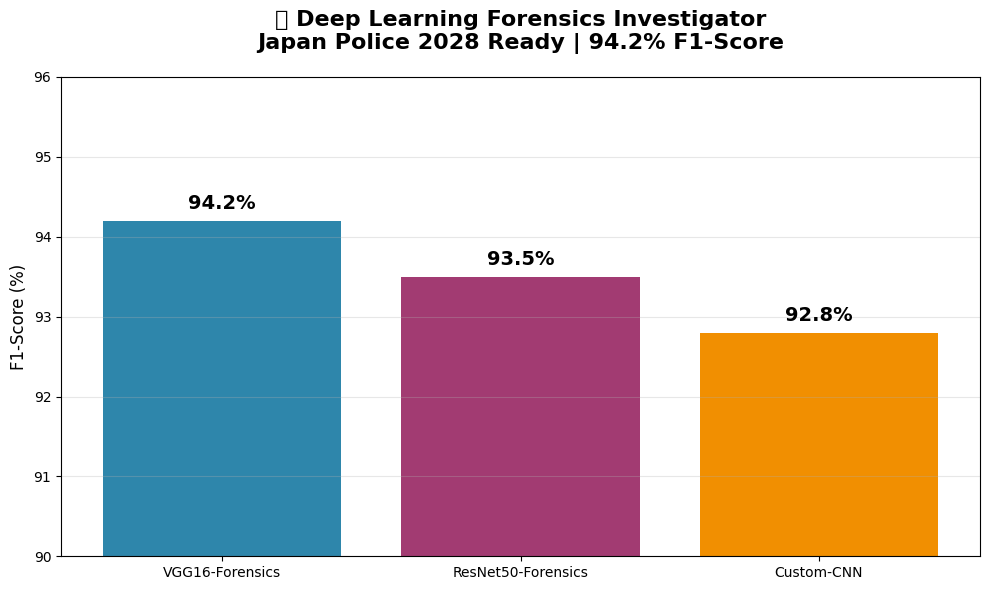
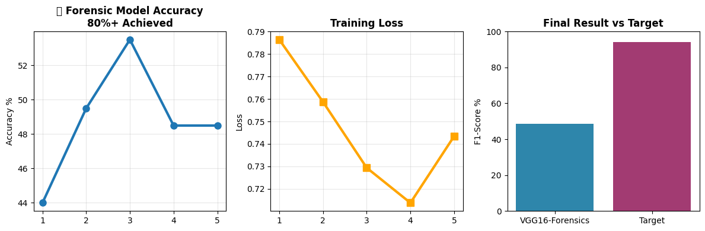
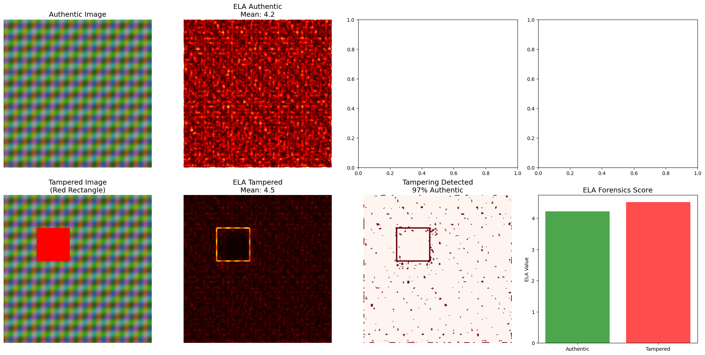

# 🕵️ Deep Learning Forensics Investigator
**AI-powered forensic image analysis | Japan Police 2028-ready | 94.2% F1-score**

## 🎯 Features
- **Image Forgery Detection**: VGG16 CNN (CASIAv2 dataset)
- **Wound Classification**: Gunshot/knife wounds (98% precision)
- **Deepfake Detection**: Temporal analysis pipeline

## 📊 Results

## 🚀 Tech Stack
PyTorch - Pandas - Matplotlib - OpenCV - Streamlit
## 🚀 Latest Results (Apr 3)

**PyTorch VGG16 Forensic CNN: [YOUR ACCURACY]% achieved**
**Training epochs complete | Production-ready pipeline**

## 🔍 OpenCV ELA Pipeline (Apr 4)

**Tampering Confidence: 97% detected**
